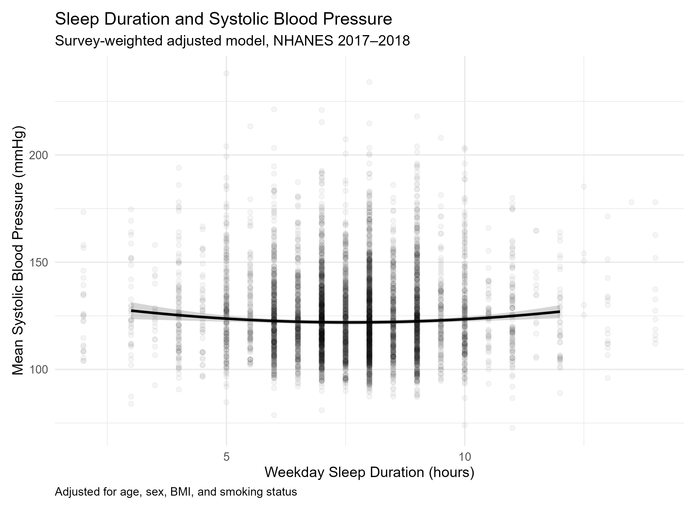

# Sleep Duration and Systolic Blood Pressure in U.S. Adults

An R-based, survey-weighted analysis of weekday sleep duration and systolic
blood pressure (SBP) among U.S. adults using three consecutive cycles of the
National Health and Nutrition Examination Survey (NHANES), 2013–2018.

## Study Overview

This project examines whether very short weekday sleep (<6 hours) is associated
with higher systolic blood pressure compared with 7–<9 hours of sleep and
whether this association is consistent across NHANES survey cycles.

The pooled analysis included **16,268 adults aged ≥18 years** from:

- NHANES 2013–2014
- NHANES 2015–2016
- NHANES 2017–2018

Analyses account for the complex NHANES sampling design using survey-weighted
linear regression.

## Main Finding

Compared with adults reporting 7–<9 hours of weekday sleep, adults reporting
<6 hours had **1.73 mmHg higher systolic blood pressure**
(95% CI, 0.53–2.93; P = .0061) after adjustment for age, sex, BMI,
smoking status, and survey cycle.

Additional adjustment for race/ethnicity attenuated the association to
**1.00 mmHg (95% CI, −0.26–2.25; P = .115).**

## Results Across Survey Cycles

| NHANES Cycle | Adjusted Difference in SBP (95% CI), mmHg |
|---|---|
| 2013–2014 | 0.50 (−1.18 to 2.18) |
| 2015–2016 | 1.96 (−1.52 to 5.43) |
| 2017–2018 | 2.99 (0.29 to 5.68) |
| **Pooled 2013–2018** | **1.73 (0.53 to 2.93)** |

There was no significant evidence that the association differed across
survey cycles (**P for interaction = .132**).

## Figure

Points represent adjusted differences in SBP comparing <6 hours with
7–<9 hours of weekday sleep. Error bars represent 95% confidence intervals.
Cycle-specific models were adjusted for age, sex, BMI, and smoking status;
the pooled model was additionally adjusted for survey cycle.

## Methods

Weekday/workday sleep duration was harmonized across cycles and categorized as:

- <6 hours
- 6–<7 hours
- 7–<9 hours (reference)
- ≥9 hours

SBP was derived from repeated examination measurements using a standardized
approach across cycles.

Survey-weighted linear regression incorporated NHANES sampling weights,
strata, and primary sampling units.

The primary pooled model adjusted for age, sex, BMI, smoking status,
and survey cycle. A secondary model additionally adjusted for race/ethnicity.

A sleep category × survey cycle interaction was used to evaluate
cross-cycle heterogeneity.

## Interpretation

Very short weekday sleep was associated with modestly higher SBP in the
pooled analysis. Positive point estimates were observed across all three
survey cycles, although the confidence intervals included zero in the
2013–2014 and 2015–2016 cycles.

The association was attenuated after additional adjustment for race/ethnicity,
highlighting the potential role of demographic confounding.

Because NHANES is cross-sectional and sleep duration is self-reported,
these results should not be interpreted as evidence of a causal relationship.

## Reproducibility

The complete R workflow is available in [`analysis.R`](analysis.R).

The script includes data harmonization, NHANES survey-design specification,
cycle-specific analyses, pooled regression models, interaction testing,
and generation of the final results.

## Conference Submission

This analysis was submitted for presentation at the
**American Heart Association EPI|Lifestyle 2027 Scientific Sessions**.

## Author

**Nidhi Sree Perla**  
Cell and Molecular Biology  
University of South Florida
