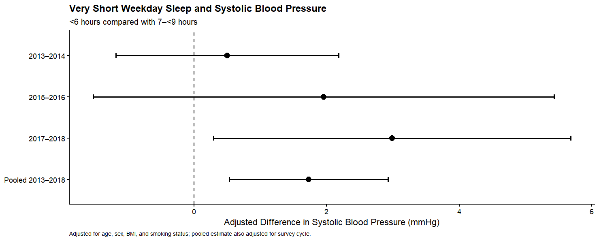

# Very Short Weekday Sleep and Systolic Blood Pressure in U.S. Adults

### A Survey-Weighted Analysis Across Three NHANES Cycles, 2013–2018

This repository contains a reproducible epidemiologic analysis of the association between **weekday sleep duration and systolic blood pressure (SBP)** among U.S. adults using data from three consecutive cycles of the National Health and Nutrition Examination Survey (NHANES), 2013–2018.

The primary objective was to determine whether **very short weekday sleep (<6 hours)** was associated with higher SBP compared with **7–<9 hours of sleep**, and to examine whether the association was reproducible across independent survey cycles.

The final pooled analytic sample included **16,268 adults aged ≥18 years**.

---

## Background

Insufficient sleep is increasingly recognized as a potentially modifiable component of cardiovascular health. Short sleep may influence blood pressure through several interconnected pathways, including altered autonomic activity, neuroendocrine signaling, metabolic regulation, inflammation, and disruption of normal cardiovascular recovery during sleep.

However, associations observed within a single survey sample may reflect sampling variability or population characteristics specific to that period.

This analysis therefore extends beyond a single NHANES cycle by examining the sleep–SBP association across **three consecutive nationally representative survey cycles** and formally testing whether the association differed across cycles.

---

## Research Question

**Among U.S. adults, is very short weekday sleep (<6 hours) associated with higher systolic blood pressure compared with 7–<9 hours of weekday sleep, and is the association consistent across NHANES 2013–2018 survey cycles?**

---

## Study Design

This study is a **pooled cross-sectional analysis** of publicly available NHANES data.

Three consecutive survey cycles were included:

- NHANES 2013–2014
- NHANES 2015–2016
- NHANES 2017–2018

The final pooled analytic sample consisted of:

**N = 16,268 adults aged ≥18 years**

NHANES uses a complex, multistage probability sampling design to collect demographic, questionnaire, physical examination, and laboratory data from the U.S. civilian, noninstitutionalized population.

All regression analyses incorporated the NHANES complex survey design.

---

## Exposure: Weekday Sleep Duration

Self-reported weekday/workday sleep duration was harmonized across the three NHANES cycles.

Sleep duration was categorized as:

| Category | Definition |
|---|---|
| Very short sleep | <6 hours |
| Short sleep | 6–<7 hours |
| Reference | **7–<9 hours** |
| Long sleep | ≥9 hours |

The prespecified contrast emphasized throughout this project was:

**<6 hours vs 7–<9 hours of weekday sleep**

Because the wording and structure of the NHANES sleep variables changed across survey cycles, variables were harmonized to create a common weekday/workday sleep-duration measure before pooling.

---

## Outcome: Systolic Blood Pressure

The primary outcome was **systolic blood pressure (SBP)** measured during the NHANES examination.

SBP was derived from repeated examination measurements using a standardized averaging approach across survey cycles.

The regression estimates therefore represent the difference in mean SBP, in **mmHg**, associated with each sleep-duration category relative to the 7–<9-hour reference category.

---

## Covariates

The primary adjusted analysis included:

- Age
- Sex
- Body mass index (BMI)
- Smoking status
- NHANES survey cycle

Race/ethnicity was incorporated in an additional model to evaluate the extent to which further demographic adjustment altered the estimated sleep–SBP association.

---

## Statistical Analysis

Analyses were performed in **R** using methods appropriate for the complex NHANES sampling design.

Survey design specification incorporated:

- MEC examination sampling weights
- Primary sampling units
- Survey strata
- Multi-cycle weighting for pooled analyses

Survey-weighted linear regression was used to estimate differences in SBP according to weekday sleep duration.

### Pooled Model Sequence

Three models were evaluated.

**Model 1 — Unadjusted**

Sleep-duration category was modeled without covariate adjustment.

**Model 2 — Primary adjusted model**

Adjusted for:

- age
- sex
- BMI
- smoking status
- survey cycle

**Model 3 — Additional demographic adjustment**

The primary model was additionally adjusted for race/ethnicity.

This sequential approach was used to examine how the estimated association changed with progressive adjustment.

---

## Cross-Cycle Replication

In addition to the pooled analysis, the primary adjusted model was estimated separately within:

- 2013–2014
- 2015–2016
- 2017–2018

Cycle-specific models adjusted for age, sex, BMI, and smoking status.

The pooled estimate was additionally adjusted for survey cycle.

A **sleep-duration category × survey-cycle interaction** was then tested to evaluate statistical evidence of heterogeneity in the sleep–SBP association across cycles.

This approach allowed the pooled finding to be considered alongside its behavior across three separate nationally representative samples.

---

# Results

## Primary Pooled Association

Compared with adults reporting **7–<9 hours of weekday sleep**, adults reporting **<6 hours** had higher SBP in the pooled analysis.

| Model | SBP Difference, mmHg | 95% CI | P value |
|---|---:|---:|---:|
| Unadjusted | 2.35 | 0.96 to 3.74 | .0015 |
| **Age + sex + BMI + smoking + cycle** | **1.73** | **0.53 to 2.93** | **.0061** |
| + Race/ethnicity | 1.00 | −0.26 to 2.25 | .115 |

### Primary Finding

In the primary adjusted model, very short weekday sleep was associated with:

**+1.73 mmHg higher SBP**  
**95% CI: 0.53 to 2.93 mmHg**  
**P = .0061**

The estimate remained positive after adjustment for age, sex, BMI, smoking status, and survey cycle.

---

## Additional Adjustment for Race/Ethnicity

After additional adjustment for race/ethnicity, the estimated difference was attenuated to:

**+1.00 mmHg**  
**95% CI: −0.26 to 2.25 mmHg**  
**P = .115**

The confidence interval included zero after this additional adjustment.

The attenuation indicates that demographic differences may account for part of the observed relationship between very short sleep and SBP.

Importantly, this secondary result is presented alongside rather than omitted from the primary analysis because it provides information about the sensitivity of the association to covariate adjustment.

---

## Results Across Survey Cycles

The adjusted point estimate for very short weekday sleep was positive in each of the three survey cycles.

| Survey Cycle | Adjusted SBP Difference, mmHg | 95% CI |
|---|---:|---:|
| 2013–2014 | +0.50 | −1.18 to 2.18 |
| 2015–2016 | +1.96 | −1.52 to 5.43 |
| 2017–2018 | +2.99 | 0.29 to 5.68 |
| **Pooled 2013–2018** | **+1.73** | **0.53 to 2.93** |

The 2013–2014 and 2015–2016 confidence intervals included zero, whereas the 2017–2018 estimate did not.

The purpose of these analyses was not to classify each individual cycle solely according to statistical significance, but to evaluate the direction, magnitude, uncertainty, and reproducibility of the association across cycles.

---

## Cross-Cycle Heterogeneity

The formal sleep-duration category × survey-cycle interaction produced:

**P for interaction = .132**

Therefore, there was **no statistically significant evidence of heterogeneity across survey cycles**.

This should not be interpreted as proof that the association was identical in every cycle. Rather, the analysis did not provide sufficient statistical evidence to conclude that the sleep–SBP association differed across cycles.

---

## Forest Plot

**Figure. Association between very short weekday sleep and systolic blood pressure across NHANES survey cycles.** Points represent survey-weighted adjusted differences in SBP comparing <6 hours with 7–<9 hours of weekday sleep; horizontal lines represent 95% confidence intervals. Cycle-specific models were adjusted for age, sex, BMI, and smoking status. The pooled estimate was additionally adjusted for survey cycle. The dashed vertical line represents a difference of 0 mmHg.

---

## Interpretation

Across three consecutive nationally representative U.S. survey cycles, adults reporting very short weekday sleep had modestly higher systolic blood pressure in the pooled analysis.

Several features of the results are notable:

1. The pooled association was present before covariate adjustment and remained statistically significant after adjustment for age, sex, BMI, smoking status, and survey cycle.

2. The adjusted point estimate was positive in each of the three individual survey cycles.

3. There was no statistically significant evidence of cross-cycle heterogeneity.

4. Additional adjustment for race/ethnicity reduced the pooled estimate from **1.73 mmHg to 1.00 mmHg**, with the confidence interval subsequently including zero.

Taken together, the findings suggest that very short weekday sleep may serve as a **marker of an adverse blood-pressure profile**, while also demonstrating that demographic confounding is important when interpreting sleep–cardiovascular associations.

The results do **not** establish that short sleep causes elevated blood pressure.

---

## Why a Modest SBP Difference May Still Be Relevant

The observed adjusted difference of approximately **1.7 mmHg** is modest at the individual level.

The objective of this analysis is therefore not to characterize very short sleep as producing a large change in an individual's blood pressure.

Instead, the finding identifies a measurable population-level difference in SBP associated with very short weekday sleep within nationally representative data.

The magnitude, uncertainty, observational design, and sensitivity to demographic adjustment should all be considered when interpreting the result.

---

## Strengths

Several aspects of the analysis strengthen the study design:

- **Large analytic sample:** 16,268 adults
- **Nationally representative data**
- **Three consecutive NHANES cycles**
- **Complex survey design incorporated into regression analyses**
- **Repeated examination-based SBP measurements**
- **Standardized cross-cycle outcome derivation**
- **Harmonization of sleep variables across survey cycles**
- **Sequential covariate adjustment**
- **Cycle-specific replication analyses**
- **Formal statistical assessment of cross-cycle heterogeneity**
- **Transparent reporting of attenuation after additional demographic adjustment**

---

## Limitations

The findings should be interpreted in the context of several limitations.

### Cross-Sectional Design

NHANES is cross-sectional. Sleep duration and blood pressure were assessed within the same survey period, preventing determination of temporal direction.

Consequently, causal inference is not appropriate.

### Self-Reported Sleep

Weekday/workday sleep duration was based on self-report and may be affected by recall error, reporting error, or differences between reported and objectively measured sleep.

### Cross-Cycle Harmonization

The NHANES sleep questionnaire changed across survey cycles. Sleep variables were harmonized to construct comparable weekday/workday sleep-duration categories, but differences in measurement structure may remain.

### Residual Confounding

Although the analyses adjusted for several important demographic and cardiovascular factors, residual or unmeasured confounding may remain.

### Sensitivity to Demographic Adjustment

The pooled association was attenuated after additional adjustment for race/ethnicity. This indicates that interpretation of the primary association should account for the influence of demographic covariates.

### Effect Size

The estimated adjusted SBP difference was modest. Statistical significance should not be interpreted as implying a large individual-level clinical effect.

---

## Reproducibility

This repository contains the analysis code and derived results necessary to document the statistical workflow.

### Repository Contents

**`analysis.R`**  
Complete R workflow including data retrieval, cleaning, cross-cycle harmonization, survey-design specification, pooled regression modeling, cycle-specific analyses, interaction testing, and figure generation.

**`model_results.csv`**  
Results from the pooled unadjusted, primary adjusted, and additional race/ethnicity-adjusted models.

**`cycle_specific_results.csv`**  
Cycle-specific and pooled estimates for the <6-hour versus 7–<9-hour comparison.

**`cycle_specific_forest_plot.png`**  
Forest plot displaying cycle-specific and pooled estimates with 95% confidence intervals.

---

## Data Availability

NHANES data are publicly available through the National Center for Health Statistics.

Raw NHANES datasets are **not redistributed in this repository**.

The analysis workflow retrieves and processes publicly available source data and documents the transformations used to construct the analytic dataset.

---

## Software

Analyses were conducted in **R**.

Primary packages used include:

- `tidyverse` — data manipulation and visualization
- `haven` — import of NHANES XPT files
- `survey` — analysis of complex survey samples

---

## Reproducing the Analysis

The primary workflow is contained in:

`analysis.R`

Running the analysis requires an internet connection to retrieve the publicly available NHANES source files and the required R packages.

The workflow performs:

1. NHANES data retrieval
2. Variable selection and cleaning
3. Sleep-variable harmonization
4. SBP derivation
5. Covariate construction
6. Cross-cycle data pooling
7. Multi-cycle survey-weight construction
8. Complex survey-design specification
9. Unadjusted regression
10. Primary adjusted regression
11. Additional race/ethnicity adjustment
12. Cycle-specific regression
13. Sleep × cycle interaction testing
14. Export of numerical results
15. Generation of the final forest plot

---

## Conference Submission

This work was submitted for consideration at the **American Heart Association EPI|Lifestyle 2027 Scientific Sessions**.

**Status: Submitted**

Submission does not imply acceptance or endorsement by the American Heart Association. The repository will be updated if the presentation status changes.

---

## Author

**Nidhi Sree Perla**  
Cell and Molecular Biology  
University of South Florida

---

## Citation

If using or building upon this analysis, please cite the repository and the original NHANES data source.

A formal citation will be added if the work is subsequently presented or published.

---

## Disclaimer

This repository contains an independent secondary analysis of publicly available NHANES data.

The findings, interpretations, and conclusions presented here are those of the author and do not represent the official positions of the National Center for Health Statistics, Centers for Disease Control and Prevention, University of South Florida, or American Heart Association.
